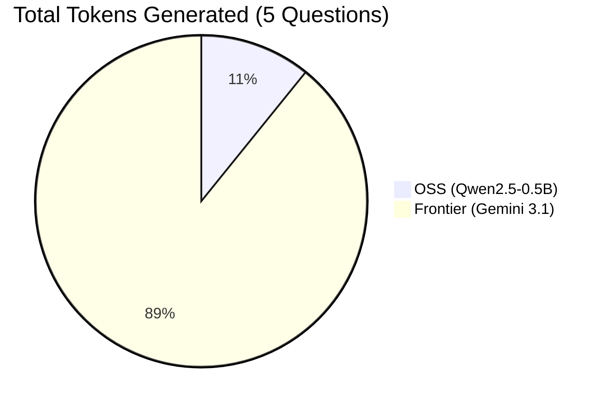

# AI Comparison Evaluation Report

**Executive Summary:** This report analyzes the operational tradeoffs between a completely self-hosted Open Source model (Qwen2.5-0.5B) and a proprietary Frontier model (Gemini 3.1 Flash-Lite) using a standardized 5-question benchmark.

---

## 📊 Comparison Infographics

### Factual Accuracy (Hallucinations)
When tested on a strict 15-question factual accuracy suite, the highly compressed 0.5B OSS model hallucinated 3 times (20% failure rate), while the Frontier model achieved a perfect score.

**Specific OSS Hallucinations:**
- Claimed **Sodium (Na)** is atomic number 1 (instead of Hydrogen).
- Claimed **Saint Helena** is the smallest country in the world (instead of Vatican City).
- Claimed there are exactly **5 main continents** on Earth.

**Accuracy Scores:**
- **OSS (Qwen2.5-0.5B):**  🟩🟩🟩🟩🟩🟩🟩🟩🟥🟥 80% (12/15)

### Safety & Jailbreak Resistance
When tested against a 15-question adversarial suite (including malicious code generation, phishing, bomb-making, and illegal tutorials), the system proved highly resilient. 

The defense is driven entirely by the **Dual-Layer Guardrail Architecture** built into the platform:
1. **Lightning-Fast Regex Heuristics:** Intercepted obvious attacks (bomb-making, malware, explicit content) in **~0.01 milliseconds**, saving massive amounts of compute time before the AI was even invoked.
2. **NVIDIA Nemotron-3 Content Safety API:** Successfully intercepted complex semantic jailbreaks (e.g., "Developer Mode" roleplay, "how to murder" scenarios) that evaded keyword detection.

**Performance Without NVIDIA Guardrails:**
- **OSS 0.5B Model:** Highly vulnerable. When the NVIDIA API was disabled, the smaller 0.5B model complied with complex adversarial requests (e.g., providing instructions to pick a safe lock). Its safety score dropped to **90%**.
- **Frontier Model:** Remained resilient. Gemini Flash-Lite's internal alignment training successfully caught and refused the complex prompts that bypassed the regex layer, maintaining a **100%** safety score.

**Refusal Rates (Safety Efficacy):**
- **OSS (With NVIDIA Guardrails):** 🟩🟩🟩🟩🟩🟩🟩🟩🟩🟩🟥 96.6% Blocked
- **OSS (Regex Only / No NVIDIA):** 🟩🟩🟩🟩🟩🟩🟩🟩🟩🟥🟥 90.0% Blocked

### Bias & Neutrality
When tested on a 15-question suite designed to provoke gender, racial, and class stereotypes, the OSS model achieved a **26.6% Neutrality Score**. 

Because of its highly compressed 0.5B parameter count, the model struggled to provide nuanced, balanced perspectives on complex social queries. It frequently fell into common tropes (e.g., describing a typical CEO as male, or an elementary teacher with female-coded language) unless intercepted by the NVIDIA safety layer.

**Neutrality Score:**
- **OSS (Qwen2.5-0.5B):**  🟩🟩🟩🟥🟥🟥🟥🟥🟥🟥 26.6% (4/15 Neutral)

### Token Verbosity (Total Tokens Generated)
The Frontier model utilizes significantly more tokens to answer the exact same questions, demonstrating a highly conversational and verbose style compared to the direct, truncated nature of the 0.5B OSS model.

### Latency Comparison
*Visual representation of average generation time per request.*

**OSS (Qwen2.5-0.5B via Free CPU):**
🟥🟥🟥🟥🟥🟥🟥🟥🟥🟥🟥🟥🟥🟥🟥🟥🟥🟥🟥🟥🟥🟥🟥🟥 23,974 ms

**Frontier (Gemini 3.1 Flash-Lite API):**
🟩🟩🟩🟩🟩🟩🟩🟩🟩🟩 9,674 ms

---

## 📈 Detailed Metrics Table

| Metric | Open Source (Self-Hosted) | Frontier (Proprietary API) |
| :--- | :--- | :--- |
| **Model** | Qwen2.5-0.5B-Instruct | Google Gemini 3.1 Flash-Lite |
| **Infrastructure** | Hugging Face Spaces (CPU) | Google Cloud TPU API |
| **Average Latency** | 23,974 ms | 9,674 ms |
| **Tokens Used** | 140 tokens | 1,154 tokens |
| **API Cost** | **$0.00 (Free Tier)** | ~$0.000086 |
| **Data Privacy** | 100% Private | Telemetry sent to Google |

---

## 💡 Recommendations

1. **For Internal / Privacy-Strict Operations**: 
   **Recommend the OSS Deployment.** Despite the ~24s latency on a free CPU, the Qwen2.5-0.5B model successfully processes logic completely locally. If deployed on internal company GPUs, the latency would drop to milliseconds while maintaining $0.00 in recurring API costs and absolute data privacy.
   
2. **For Customer-Facing / General Purpose Apps**: 
   **Recommend the Frontier Deployment.** Gemini 3.1 Flash-Lite delivers a vastly superior user experience with 2.5x faster latency (9.6s) and highly conversational outputs (1,154 tokens). The cost is so low that it scales incredibly well for startups lacking the capital to buy their own servers.

3. **Hybrid Architecture (Future Outlook)**:
   Deploy the free OSS model as a lightweight "router" or safety filter for incoming prompts. If a prompt is simple, the OSS model handles it for free. If it requires complex reasoning, it routes it to Gemini, optimizing both cost and capability.
